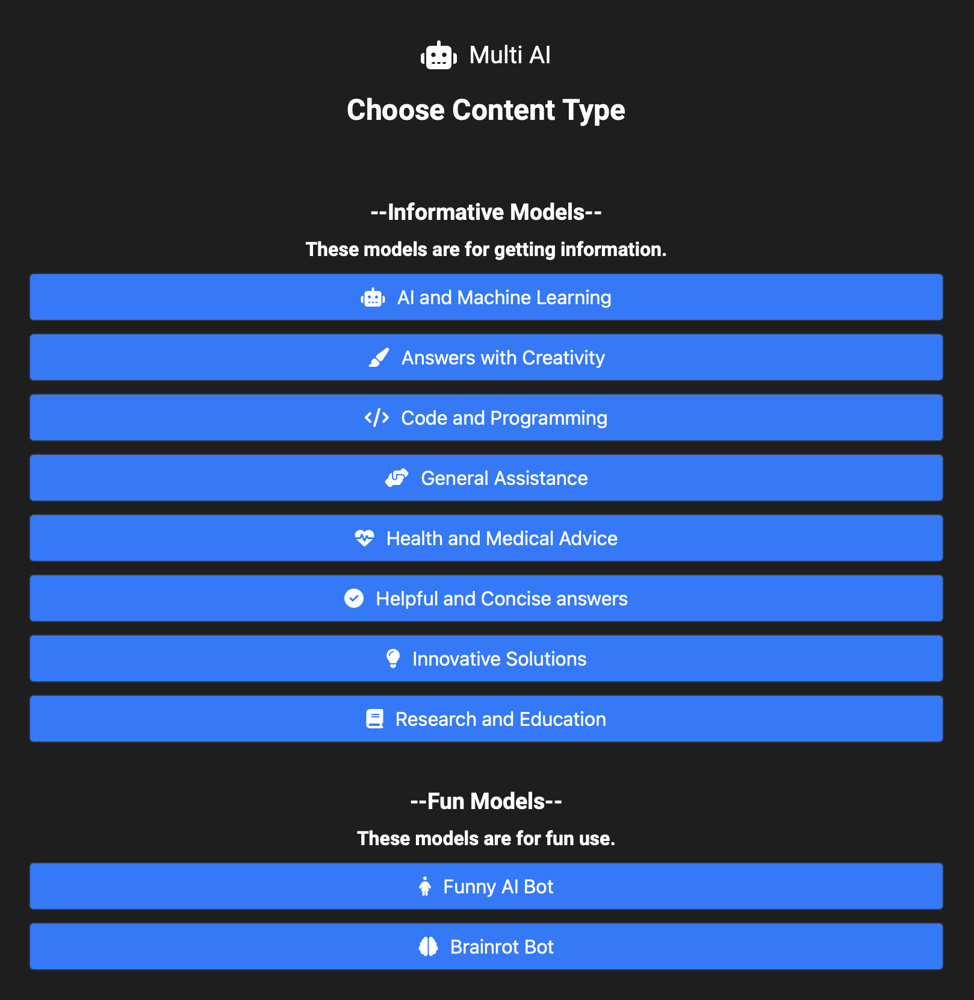

[comment]: <> (MIT License)
[comment]: <> (Copyright c 2024 Aadish Samir)
[comment]: <> (See the LICENSE file in the root of this repository for details.)

# Multi AI

An AI Application which allows users to discover multiple AI Models and Personalities. Have fun with the fun models given too!
## Website
Access the website for Multi AI at [this link](https://aadishsamir123.github.io/Multi-AI)

## Screenshots

